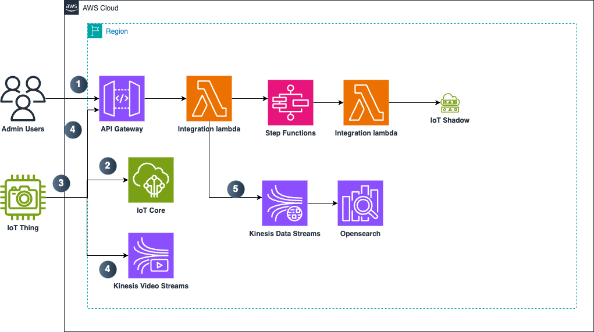
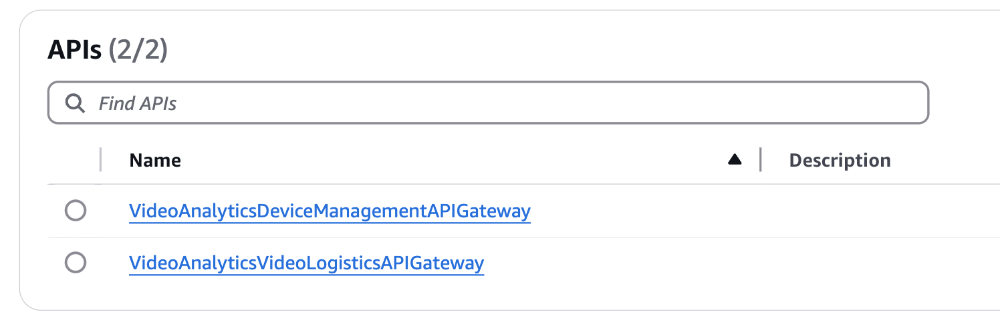

# Guidance for Video Analytics Infrastructure on AWS

## Table of Contents

1. [Overview](#overview-required)
    - [Cost](#cost)
2. [Prerequisites](#prerequisites-required)
    - [Operating System](#operating-system-required)
3. [Deployment Steps](#deployment-steps-required)
4. [Deployment Validation](#deployment-validation-required)
5. [Running the Guidance](#running-the-guidance-required)
6. [Next Steps](#next-steps-required)
7. [Cleanup](#cleanup-required)


8. [FAQ, known issues, additional considerations, and limitations](#faq-known-issues-additional-considerations-and-limitations-optional)
9. [Revisions](#revisions-optional)
10. [Notices](#notices-optional)
11. [Authors](#authors-optional)

## Overview 

  This guidance handles the heavy lifting of setting up [**AWS IoT Core**](https://aws.amazon.com/iot-core/) (**IoT Core**) and [**Amazon Kinesis Video Stream**](https://aws.amazon.com/kinesis/video-streams/) (**KVS**) on edge device and in the cloud to provide the infrastructure for video analytics applications. IoT Core and KVS are two required AWS services to build video analytics applications. Customer who aims to use IoT and Amazon KVS to transport video or use [**Amazon API Gateway**](https://aws.amazon.com/api-gateway/) (**API Gateway**) and [**AWS Lambda**](https://aws.amazon.com/lambda/) (**Lambda**) to send AI inference data from edge to cloud is required to invest time to implement device clients to communicate with those services. With this guidance handling the undifferentiated components of video analytics application, it frees up customers time to build applications, such as end-to-end edge to cloud computer vision operations (CVOps) systems, on top of this guidance. 
  
  Below is a list of the default features and optional features provided by this guidance. Default features are available out-of-the-box once resources are deployed. Optional features are provided in sample code format. Customers need to integrate the sample code into the guidance for optional features to work. See [implementation guide](https://implementationguides.kits.eventoutfitters.aws.dev/vanlytcs-infra-1204/ai-ml/video-analytics-infrastructure-on-aws/index.html) for detail instructions.
  
  #### Default features:
  - Livestream and playback videos
  - Forward selected video and inference data from edge device to cloud
  - Provide a preview image captured by the device to display in front-end UI 
  - Provide timestamps information of video to display in front-end UI 

  #### Optional features:
  - Query inference data stored on cloud
  - Export video stored on cloud for end users to download
  - Remote operations. Such as reboot device, firmware update, 
  - Remote configurations. Such as configure image settings and AI settings on device.
  - Device state management
  - Resource clean up
 
  #### Architecture overview ####
  

  This guidance is consist of two microservices - device management (DM) and video logistics (VL). DM is responsible for managing device lifecycle and device's authorization and permission to interact with cloud. VL is responsible for transferring video/AI inference data from edge device to cloud. DM and VL features provided in the guidance are orchestrated by edge device binary and Java code deployed to Lambdas. Edge source code implemented in Rust is organized by feature. Loosely speaking, each Rust crate represents a feature in the guidance. Cloud code written in Java is organized based on the two microservices: DM and VL. For the cloud components, each microservice has its API smithy models, Java client, control plane application, and CloudFormation stacks. 

  For detailed information about the APIs and components, see [source/README.md](source/README.md) for comprehensive documentation of API actions, component overview, and build instructions

### Cost 

You are responsible for the cost of the AWS services used while running this Guidance. As of Jan 2025, the cost for running this Guidance with the input parameters in the table below in the US East (N. Virginia) is approximately $50 per month per device. Main cost drivers are the amount of videos and AI events ingested as well as the retention period of the AI events stored. 


| Input parameters  | Value used for cost estimation 
| ----------- | ------------ |
| Device up time  | 24 hrs/day |
| Kinesis Data Stream mode | on-demand | 
| Video bitrate | 1024 Kbps | 
| Number of AI events | 3600 events/day | 
| AI event thumbnail size | 150 KB | 
| AI event retention | 7 days | 
| KVS ingestion retention | 30 days | 


We recommend creating a [Budget](https://docs.aws.amazon.com/cost-management/latest/userguide/budgets-managing-costs.html) through [AWS Cost Explorer](https://aws.amazon.com/aws-cost-management/aws-cost-explorer/) to help manage costs. Prices are subject to change. For full details, refer to the pricing webpage for each AWS service used in this Guidance.

#### Sample Cost Table 

The following table provides a sample cost breakdown of the core AWS services (KVS/KDS/IoT) used in this Guidance with the default parameters in the US East (N. Virginia) Region for one month per device.

| AWS service  | Dimensions | Cost [USD] |
| ----------- | ------------ | ------------ |
| KVS ingestion and storage | ingest videos 24hrs per day, bitrate (average 1024 Kbps), video retention (7 days) | $ 4.43/month |
| KVS livestream | livestream sessions (300 per month ), per livestream session duration (1 hour), TURN usage (100%)| $ 11.88/month |
| KDS ingestion and storage | on-demand mode, Records (3600 per day), Record size (150KB), and data retention (7 days) | $ 30.76/month |
| IoT MQTT messages | Number of messages (100,000 per month ) and Per message size (50 KB) | $ 1.00/month |
| IoT shadow writes | Shadow operations (600 per month ), Payload size per shadow operations (50 KB) | $ 0.04/month |
| API Gateway | Number of requests (1000 per month), Average size of each request (50 KB) | $0.00/month |
| Lambda | Number of requests (1000 per month), Average size of each request (50 KB) | $0.00/month |
| DDB | Table class (Standard), Average item size (all attributes) (1 KB), Data storage size (1 GB) | $0.25/month |
| S3| Standard storage (1 GB per month), Average object size (50 MB), | $0.02/month |

#### Call outs

* None of the optional features in the guidance: device command, device configuration, video export, and query inference are included in the cost estimation provided above. 
* Cost estimation provided for KVS/KDS only includes ingestion and storage but doesn't include the cost of reading data stored in KVS and KDS.
* Estimation does not take into account Free Tier discounts.

#### Cost saving tip

* Save cost by enabling motion-based streaming following the instruction [here](https://github.com/aws-solutions-library-samples/guidance-for-video-analytics-infrastructure-on-aws/blob/develop/source/edge/DEVELOPMENT.md#motion-based-streaming). By default, motion-based Streaming is set to true. When motion-based streaming is set to true, the guidance will only ingest video and AI events data when motion is detected by the camera. 


## Prerequisites 

### Hardware 
An Open Network Video Interface Forum (ONVIF) compliant edge device must be set up to benefit from all features provided in the guidance. In the absence of ONVIF compliant cameras, simulated RTSP stream from recorded mp4 videos can be used. However, when edge process operates in simulated RTSP stream mode, not all features will be present. See [implementation guide]() on detail instructions to run the guidance in simulated RTSP stream mode. 

### Operating System

This deployment has been tested on macOS and Linux operating systems. Follow these steps in order:

1. **AWS Account and CLI Setup**
   - An AWS account with administrative permissions
   - [AWS CLI version 2](https://docs.aws.amazon.com/cli/latest/userguide/getting-started-install.html) installed and configured
   - Configure AWS CLI with your credentials:
     ```bash
     aws configure
     ```

2. **Development Tools**
   - Java Development Kit (JDK) 17 or higher
     ```bash
     # For macOS using Homebrew
     brew install openjdk@17
     
     # For Ubuntu/Debian
     sudo apt update
     sudo apt install openjdk-17-jdk
     
     # For Amazon Linux/RHEL/CentOS
     # Per: https://docs.aws.amazon.com/corretto/latest/corretto-17-ug/amazon-linux-install.html
     sudo yum install java-17-amazon-corretto
     
     # Verify installation
     java -version
     ```
   
   - Node.js (v18 or higher) and npm
     ```bash
     # For macOS using Homebrew
     brew install node@18
     
     # For Ubuntu/Debian
     curl -fsSL https://deb.nodesource.com/setup_18.x | sudo -E bash -
     sudo apt-get install -y nodejs
     
     # For Amazon Linux/RHEL/CentOS
     curl -fsSL https://rpm.nodesource.com/setup_18.x | sudo bash -
     sudo yum install -y nodejs
     
     # Verify installation
     node --version
     npm --version
     ```

3. **GStreamer and KVS Plugin Setup**
   Amazon Kinesis Video Streams (KVS) GStreamer Plugin is required for running and testing the edge binary for video processing.
   
   For detailed information, refer to:
   - [KVS Gstreamer Plugin Producer SDK Documentation](https://github.com/awslabs/amazon-kinesis-video-streams-producer-sdk-cpp/blob/master/README.md)
   - [Linux Setup Guide](https://github.com/awslabs/amazon-kinesis-video-streams-producer-sdk-cpp/blob/master/docs/linux.md)
   - [macOS Setup Guide](https://github.com/awslabs/amazon-kinesis-video-streams-producer-sdk-cpp/blob/master/docs/macos.md)

   1. **Install GStreamer Base Requirements**
      - For macOS:
        ```bash
        brew install pkg-config openssl cmake gstreamer gst-plugins-base \
          gst-plugins-good gst-plugins-bad gst-plugins-ugly log4cplus gst-libav
        ```

      - For Ubuntu/Debian:
        ```bash
        # Install build dependencies
        sudo apt-get install -y cmake m4 git build-essential

        # Install GStreamer and development dependencies
        sudo apt-get install -y \
          libssl-dev libcurl4-openssl-dev liblog4cplus-dev \
          libgstreamer1.0-dev libgstreamer-plugins-base1.0-dev \
          gstreamer1.0-plugins-base-apps gstreamer1.0-plugins-bad \
          gstreamer1.0-plugins-good gstreamer1.0-plugins-ugly \
          gstreamer1.0-tools
        ```

      - For RHEL/CentOS:
        ```bash
        # Install build dependencies
        sudo yum install -y cmake git m4
        sudo yum groupinstall -y 'Development Tools'

        # Install GStreamer and development dependencies
        sudo yum install -y \
          openssl-devel libcurl-devel log4cplus-devel \
          gstreamer1-devel gstreamer1-plugins-base-devel \
          gstreamer1-plugins-good gstreamer1-plugins-bad-free \
          gstreamer1-plugins-ugly-free gstreamer1-tools \
          gstreamer1-plugins-base-tools gstreamer1-plugins-bad-free-devel
        ```

   2. **Build and Install KVS GStreamer Plugin**
      ```bash
      # Clone the KVS Producer SDK
      git clone https://github.com/awslabs/amazon-kinesis-video-streams-producer-sdk-cpp.git
      cd amazon-kinesis-video-streams-producer-sdk-cpp

      # Create and enter build directory
      mkdir -p build
      cd build

      # Configure with GStreamer plugin enabled
      cmake .. -DBUILD_GSTREAMER_PLUGIN=ON

      # Build the plugin
      make
      ```

   3. **Configure Environment**
      Add these to your shell profile (~/.bashrc, ~/.zshrc, etc.):
      ```bash
      # Set AWS credentials
      export AWS_ACCESS_KEY_ID=YourAccessKeyId
      export AWS_SECRET_ACCESS_KEY=YourSecretAccessKey
      # Optional: Set region and session token if needed
      export AWS_DEFAULT_REGION=us-west-2  # Change to your desired region
      export AWS_SESSION_TOKEN=YourSessionToken  # If using temporary credentials

      # Set KVS GStreamer plugin paths
      # Note: Replace /path/to/kvs-producer-sdk with the actual path
      export GST_PLUGIN_PATH=/path/to/kvs-producer-sdk/build
      export LD_LIBRARY_PATH=/path/to/kvs-producer-sdk/open-source/local/lib
      ```

   4. **Verify Installation**
      ```bash
      # Verify GStreamer base installation
      gst-launch-1.0 --version

      # Verify KVS plugin installation
      gst-inspect-1.0 kvssink
      ```

      Expected output for kvssink should show:
      ```
      Factory Details:
        Rank                     primary + 10 (266)
        Long-name                KVS Sink
        Klass                    Sink/Video/Network
        Description              GStreamer AWS KVS plugin
      ```

      The device monitor will show available video devices:
      ```
      Probing devices...

      Device found:
          name  : H264 USB Camera  # Your device name may vary
      ```

   Note: If you get "No such element or plugin 'kvssink'", check that:
   - The build completed successfully
   - GST_PLUGIN_PATH is set correctly
   - You're running the command from the correct directory
   - All required dependencies were installed successfully

4. **AWS CDK CLI**
   ```bash
   npm install -g aws-cdk
   
   # Verify installation
   cdk --version
   ```

5. **Rust Development Environment** (Required for Edge Components)
   - Install Rust and Cargo
     ```bash
     curl --proto '=https' --tlsv1.2 -sSf https://sh.rustup.rs | sh
     source $HOME/.cargo/env
     
     # Verify installation
     rustc --version
     cargo --version
     ```
   
   - Install Cross (for cross-compilation)
     ```bash
     cargo install cross --git https://github.com/cross-rs/cross
     ```
    Note, cross compiling edge binary depends on Gstreamer. Refer to previous section Install GStreamer Base Requirements for its installation. 
6. **Additional Tools**
   - Git
     ```bash
     # For macOS using Homebrew
     brew install git
     
     # For Ubuntu/Debian
     sudo apt install git
     
     # For Amazon Linux/RHEL/CentOS
     sudo yum install git
     
     # Verify installation
     git --version
     ```
   
   - AWS Systems Manager Session Manager plugin (for camera access)
     ```bash
     # For macOS
     curl "https://s3.amazonaws.com/session-manager-downloads/plugin/latest/mac/sessionmanager-bundle.zip" -o "sessionmanager-bundle.zip"
     unzip sessionmanager-bundle.zip
     sudo ./sessionmanager-bundle/install -i /usr/local/sessionmanagerplugin -b /usr/local/bin/session-manager-plugin
     
     # For Linux
     curl "https://s3.amazonaws.com/session-manager-downloads/plugin/latest/linux_64bit/session-manager-plugin.rpm" -o "session-manager-plugin.rpm"
     sudo yum install -y session-manager-plugin.rpm
     
     # Verify installation
     session-manager-plugin --version
     ```

7. **Project Setup**
   ```bash
   # Clone the repository
   git clone <repository-url>
   cd guidance-for-video-analytics-infrastructure-on-aws
   
   # Install dependencies for deployment
   cd deployment
   npm install
   
   # Build common constructs
   cd common-constructs/VideoAnalyticsCommonConstruct
   npm install
   npm run build
   
   # Return to root directory
   cd ../../..
   ```

8. **Environment Configuration**
   ```bash
   # Set required environment variables
   export AWS_REGION=<your-preferred-region>  # e.g., us-east-1
   ```

### Required AWS Account Permissions

The deployment requires an AWS account with permissions to create and manage the following services:
- AWS Lambda
- Amazon API Gateway
- Amazon S3
- Amazon DynamoDB
- AWS IoT Core
- Amazon Kinesis Video Streams
- AWS Systems Manager
- AWS IAM (for creating roles and policies)

### Network Requirements
- Outbound internet access for downloading dependencies and accessing AWS services
- If working with cameras:
  - Access to port 80 (ONVIF)
  - Access to port 554 (RTSP)
  - Proper network configuration to allow communication between edge devices and AWS cloud services

## Deployment Steps

> For detailed deployment instructions and build steps, see the [deployment/README.md](deployment/README.md).

1. **Device Management (deployment/device-management-cdk/)**
   - Handles device registration, management, and monitoring
   - Components:
     - Bootstrap Stack: Initial setup and shared resources
     - Workflow Stack: Device management workflows
     - Service Stack: Core Video Analytics Async Device Management services

2. **Video Logistics (deployment/video-logistics-cdk/)**
   - Manages video processing and analytics
   - Components:
     - Bootstrap Stack: Initial setup
     - Timeline Stack: Video timeline management
     - OpenSearch Stack: Search and analytics
     - Bulk Inference Stack: Video processing
     - Workflow Stack: Video processing workflows
     - Service Stack: Core Video Analytics Async Video Logistics Processing services

### Environment Variables

The deployment uses either explicitly set deployment variables OR falls back to default variables:

```bash
# Option 1: Set deployment-specific variables
export CDK_DEPLOY_ACCOUNT=your_aws_account_id
export CDK_DEPLOY_REGION=your_aws_region

# OR

# Option 2: Use default variables
export CDK_DEFAULT_ACCOUNT=your_aws_account_id
export CDK_DEFAULT_REGION=your_aws_region
```

The stack will use variables in this order:
1. `CDK_DEPLOY_ACCOUNT/REGION` if set
2. `CDK_DEFAULT_ACCOUNT/REGION` if set
3. Default values:
   - Region: us-east-1 (Device Management) or us-west-2 (Video Logistics)
   - Account: "YOUR_DEFAULT_ACCOUNT"

### Deployment Process

1. **Clone the Repository**
   ```bash
   git clone <repository-url>
   cd guidance-for-video-analytics-infrastructure-on-aws
   ```

2. **Install Global Dependencies**
   ```bash
   npm install -g aws-cdk typescript
   ```

3. **Install Project Dependencies**
   ```bash
   cd deployment
   npm install
   ```

4. **Build Common Constructs(Used for both Device Management and Video Logistics)**
   ```bash
   cd common-constructs/VideoAnalyticsCommonConstruct
   npm install
   npm run build
   ```

5. **Deploy Device Management Infrastructure**
   ```bash
   cd ../../device-management-cdk/VideoAnalyticsDeviceManagementCDK
   npm install
   
   # Update snapshot tests if needed
   npm run test -- -u
   
   # Build and synthesize CloudFormation
   npm run build
   cdk synth

   # Bootstrap CDK if needed(1st time only)
   cdk bootstrap
   
   # Deploy stacks in order
   cdk deploy DeviceManagementBootstrapStack
   cdk deploy DeviceManagementWorkflowStack
   cdk deploy DeviceManagementServiceStack
   ```

6. **Deploy Video Logistics Infrastructure**
   ```bash
   cd ../../video-logistics-cdk/VideoAnalyticsVideoLogisticsCDK
   npm install
   
   # Update snapshot tests if needed
   npm run test -- -u
   
   # Build and synthesize CloudFormation
   npm run build
   cdk synth

   # Bootstrap CDK if needed(1st time only)
   cdk bootstrap
   
   # Deploy stacks in order
   cdk deploy VideoLogisticsBootstrapStack
   cdk deploy VideoLogisticsTimelineStack
   cdk deploy VideoLogisticsOpensearchStack
   cdk deploy VideoLogisticsBulkInferenceStack
   cdk deploy VideoLogisticsWorkflowStack
   cdk deploy VideoLogisticsServiceStack
   ```

## Deployment Validation

After deploying both Device Management and Video Logistics stacks, verify the deployment by checking the following resources:

### Device Management CloudFormation Stack Verification

Verify the following CloudFormation stacks are deployed successfully:

```bash
# Verify all Device Management stacks status
aws cloudformation describe-stacks \
  --query 'Stacks[?contains(StackName, `DeviceManagement`)].{Name:StackName,Status:StackStatus}' \
  --output table
```

Check for the following stacks with status "CREATE_COMPLETE":

1. **Bootstrap Stack**
   - Stack name: `DeviceManagementBootstrapStack`
   ```bash
   aws cloudformation describe-stacks \
     --stack-name DeviceManagementBootstrapStack \
     --query 'Stacks[0].{Name:StackName,Status:StackStatus,Outputs:Outputs}'
   ```

2. **Core Components**
   - Stack name: `DeviceManagementServiceStack`
   ```bash
   aws cloudformation describe-stacks \
     --stack-name DeviceManagementServiceStack \
     --query 'Stacks[0].{Name:StackName,Status:StackStatus,Outputs:Outputs}'
   ```

3. **Workflow Components**
   - Stack name: `DeviceManagementWorkflowStack`
   ```bash
   aws cloudformation describe-stacks \
     --stack-name DeviceManagementWorkflowStack \
     --query 'Stacks[0].{Name:StackName,Status:StackStatus,Outputs:Outputs}'
   ```

You can verify individual stack resources using:
```bash
# Replace STACK_NAME with the specific stack name
aws cloudformation describe-stack-resources \
  --stack-name STACK_NAME \
  --query 'StackResources[].{LogicalID:LogicalResourceId,Type:ResourceType,Status:ResourceStatus}'
```

### Video Logistics CloudFormation Stack Verification

Verify the following CloudFormation stacks are deployed successfully:

```bash
# Verify all Video Logistics stacks status
aws cloudformation describe-stacks \
  --query 'Stacks[?contains(StackName, `VideoLogistics`)].{Name:StackName,Status:StackStatus}' \
  --output table
```

Check for the following stacks with status "CREATE_COMPLETE":

1. **Bootstrap Stack**
   - Stack name: `VideoLogisticsBootstrapStack`
   ```bash
   aws cloudformation describe-stacks \
     --stack-name VideoLogisticsBootstrapStack \
     --query 'Stacks[0].{Name:StackName,Status:StackStatus,Outputs:Outputs}'
   ```
2. **Core Infrastructure**
   - Stack name: `VideoLogisticsOpensearchStack`
   - Stack name: `VideoLogisticsTimelineStack`
   - Stack name: `VideoLogisticsServiceStack`

3. **Processing Components**
   - Stack name: `VideoLogisticsBulkInferenceStack`
   - Stack name: `VideoLogisticsVideoExportStack`
   - Stack name: `VideoLogisticsWorkflowStack`

4. **Management Components**
   - Stack name: `VideoLogisticsSchedulerStack`
   - Stack name: `VideoLogisticsForwardingRulesStack`

You can verify individual stack details using:
```bash
# Replace STACK_NAME with the specific stack name
aws cloudformation describe-stack-resources \
  --stack-name STACK_NAME \
  --query 'StackResources[].{LogicalID:LogicalResourceId,Type:ResourceType,Status:ResourceStatus}'
```

### API Gateway Endpoints Verification

After deployment, you should see two API Gateway endpoints in the AWS Console:



The endpoints should show:
- VideoAnalyticsDeviceManagementAPIGateway (Edge-optimized REST API)
- VideoAnalyticsVideoLogisticsAPIGateway (Edge-optimized REST API)

These endpoints are used for device management and video logistics operations respectively.

You can verify these endpoints using AWS CLI:

#### Device Management API
```bash
# List API Gateway APIs and find VideoAnalyticsDeviceManagementAPIGateway
aws apigateway get-rest-apis \
  --query 'items[?contains(name, `VideoAnalyticsDeviceManagementAPIGateway`)].{Name:name,ID:id}'

# Get the API ID from above command output and verify stages
export DM_API_ID=<api-id-from-above>
aws apigateway get-stages --rest-api-id $DM_API_ID

# Verify API resources and methods
aws apigateway get-resources --rest-api-id $DM_API_ID \
  --query 'items[?contains(name, `VideoAnalyticsDeviceManagementAPIGateway`)].{Name:name,Type:type}'
```

Expected output should show:
- API named "VideoAnalyticsDeviceManagementAPIGateway"
- Stage "prod" deployed
- Resources for device management operations

#### Video Logistics API
```bash
# List API Gateway APIs and find VideoAnalyticsVideoLogisticsAPIGateway
aws apigateway get-rest-apis \
  --query 'items[?contains(name, `VideoAnalyticsVideoLogisticsAPIGateway`)].{Name:name,ID:id}'

# Get the API ID from above command output and verify stages
export VL_API_ID=<api-id-from-above>
aws apigateway get-stages --rest-api-id $VL_API_ID

# Verify API resources and methods
aws apigateway get-resources --rest-api-id $VL_API_ID
```

Expected output should show:
- API named "VideoAnalyticsVideoLogisticsAPIGateway"
- Stage "prod" deployed
- Resources for video processing operations

### Test API Endpoints

After verifying the API Gateway deployments, you can test the endpoints:

```bash
# Get Device Management API endpoint
export DM_API_ENDPOINT=$(aws apigateway get-rest-apis \
  --query 'items[?contains(name, `VideoAnalyticsDeviceManagementAPIGateway`)].{endpoint:endpoint}' \
  --output text)

# Get Video Logistics API endpoint
export VL_API_ENDPOINT=$(aws apigateway get-rest-apis \
  --query 'items[?contains(name, `VideoAnalyticsVideoLogisticsAPIGateway`)].{endpoint:endpoint}' \
  --output text)

# Test Device Management health check endpoint
curl -X GET "${DM_API_ENDPOINT}/prod/health"

# Test Video Logistics health check endpoint
curl -X GET "${VL_API_ENDPOINT}/prod/health"
```

Both health check endpoints should return a successful response indicating the APIs are properly deployed and functioning.

### Additional Verification Steps

- Check CloudWatch Logs for any deployment errors
- Verify IAM roles and policies are correctly created
- Ensure all Lambda functions are deployed and configured
- Check DynamoDB tables are created with correct schemas
- Verify S3 buckets are created with proper permissions

If any of these verification steps fail, check the CloudFormation stack events and CloudWatch logs for error details.

## Running the Guidance

### Guidance inputs

Most API calls can be made within package for functional integration with your guidance project. Below are examples of API request and response bodies for all APIs included in this guidance. 

#### Device Registration
##### `POST /start-create-device/{deviceId}` - Start device registration process
- API input example
  ```json
  {
    "certificateId": "b2916b9d0ed02f98126789d23ce7a73ec030b68584245ed68838cf166287943a"  // required
  }
  ```
- API output example
  ```json
  {
    "jobId": "92fdb31b-c984-4e7d-b20e-a1f0f6724989"
  }
  ```
##### `POST /get-create-device-status/{jobId}` - Get status of device registration
- No API input body required
- API output example
  ```json
  {
    "jobId": "92fdb31b-c984-4e7d-b20e-a1f0f6724989",
    "deviceId": "example-device-id",
    "status": "COMPLETED",
    "createTime":"2025-01-15T20:54:27.000Z", // ISO 8601 date-time format
    "modifiedTime":"2025-01-15T20:54:27.000Z" // ISO 8601 date-time format
  }
  ```

#### Device Operations
##### `POST /get-device/{deviceId}` - Get device information
- No API input body required
- API output example
  ```json
  {
    "deviceId": "example-device-id",
    "deviceGroupIds": [],
    "deviceMetaData": {
      "ipAddress": {},
      "deviceStatus": {
        "deviceState": "ENABLED",
        "deviceConnection": {
          "status": false
        },
        "cloudVideoStreaming": [
          {}
        ],
        "storage": [
          {}
        ]
      }
    },
    "deviceCapabilities": {},
    "deviceSettings": {},
    "createdAt": "2025-01-15T20:54:27.000Z"  // ISO 8601 date-time format
  }
  ```
##### `POST /get-device-shadow/{deviceId}` - Get device shadow (current state)
- API input example
  ```json
  {
    "shadowName": "provision"  
  }
  ```
- API output example
  ```json
  {
    "shadowPayload": {
      "shadowName": "provision",
      "stateDocument": {
        "loggerSettings": {
          "logLevel":"INFO",
          "syncFrequency":300,
          "isEnabled":true
        },
        "enabled":true
      }
    }
  }
  ```
##### `POST /update-device-shadow/{deviceId}` - Update device shadow (desired state)
- API input example
  ```json
  {
    "shadowPayload": {
      "shadowName": "provision",
      "stateDocument": {
        "loggerSettings": {
          "logLevel":"ERROR",
          "syncFrequency":500,
          "isEnabled":true
        },
        "enabled":true
      }
    }
  }
  ```
- API output example
  ```json
  {
    "deviceId": "example-device-id"
  }
  ```

#### Device Registration
##### `POST /get-vl-register-device-status/{jobId}` - Get status of video logistics registration
- No API input body required
- API output example
  ```json
  {
    "jobId": "92fdb31b-c984-4e7d-b20e-a1f0f6724989",
    "deviceId": "example-device-id",
    "status": "COMPLETED",
    "createTime":"2025-01-15T22:32:05.197Z",
    "modifiedTime":"2025-01-15T22:32:05.197Z",
    "kvsStreamArns": ["arn:aws:kinesisvideo:us-west-2:123456789012:stream/my-stream-name/1705359125197"]
  }
  ```

#### Livestreaming
##### `POST /create-livestream-session` - Create a new livestream session
- API input example
  ```json
  {
    "deviceId": "example-device-id",
    "clientId": "example-client-id"  
  }
  ```
- API output example
  ```json
  {
    "sessionId": "e2d2367f-d2a2-4d65-aba1-f1500b7c9aee",
    "clientId": "example-client-id",
    "iceServers": [
      {
        "password": "6cX7qPV8oWfwc42r9BN3",
        "ttl": 300.0,
        "uris": [
          "turn:54.148.x.x:443?transport=udp",
          "turns:54.148.x.x:443?transport=tcp"
        ],
        "username": "1705363200:kvs/teststream"
      }
    ],
    "signalingChannelURL": "string"
  }
  ```

#### Playback
##### `POST /create-playback-session` - Create a new playback session
- API input example
  ```json
  {
    "deviceId": "example-device-id",
    "startTime": "2025-01-15T22:00:00Z",  // ISO 8601 date-time format
    "endTime": "2025-01-15T23:00:00Z"     // ISO 8601 date-time format
  }
  ```
- API output example
  ```json
  {
    "streamSources": [
      {
        "sourceType": "HLS",
        "source": {
          "hLSStreamingURL": "https://b-35e552df.kinesisvideo.us-west-2.amazonaws.com/hls/v1/getHLSMasterPlaylist.m3u8?SessionToken=CiBSZUrGzxlWR3UEqiWYo8eon66Muc6e23MwiET2QxjZfBIQ8KU4EzBzba8K1wlzIbMxkhoZxY1u5YxwBbsnqQefljlUsyVVjryz0C9b2SIgSZ2-kM9f2iKhAHK9q3Z0hM96kb2mDxVTdkqJTXhRiJw~"
        }
      }
    ]
  }
  ```
  
#### Video Timeline
##### `POST /list-video-timelines` - List available video timelines
- API input example
  ```json
  {
    "deviceId": "example-device-id",
    "startTime": "2024-02-20T00:00:00Z", // ISO 8601 date-time format
    "endTime": "2024-02-20T01:00:00Z", // ISO 8601 date-time format
    "timeIncrement": 5,
    "timeIncrementUnits": "MINUTES",       
    "nextToken": "eyJkZXZpY2VJZCI6ImQxMjMiLCJ0aW1lc3RhbXAiOjE2OTc4Mjc5MjB9" // optional pagination token
  }
  ```
- API output example
  ```json
  {
    "deviceId": "example-device-id",
    "startTime": "2024-01-16T12:00:00Z",
    "endTime": "2024-01-16T13:00:00Z",
    "timeIncrement": 5,
    "timeIncrementUnits": "MINUTES",
    "videoTimelines": [
      {
        "cloudDensity": 0.0,
        "deviceDensity": 0.0
      },
      {
        "cloudDensity": 0.0,
        "deviceDensity": 0.0
      },
      {
        "cloudDensity": 0.6942166686058044,
        "deviceDensity": 0.0
      },
      {
        "cloudDensity": 0.9998166561126709,
        "deviceDensity": 0.0
      }
    ],
    "nextToken": "eyJkZXZpY2VJZCI6ImQxMjMiLCJ0aW1lc3RhbXAiOjE2OTc4Mjc5MjB9"
  }
  ```
##### `POST /list-detailed-video-timeline` - Get detailed video timeline information
- API input example
  ```json
  {
    "deviceId": "example-device-id",
    "startTime": "2024-01-16T12:00:00Z",  // ISO 8601 date-time format
    "endTime": "2024-01-16T13:00:00Z",    // ISO 8601 date-time format
    "nextToken": "eyJkZXZpY2VJZCI6ImQxMjMiLCJ0aW1lc3RhbXAiOjE2OTc4Mjc5MjB9"                  // optional pagination token
  }
  ```
- API output example
  ```json
  {
    "deviceId": "example-device-id",
    "startTime": "2024-01-16T12:00:00Z",
    "endTime": "2024-01-16T13:00:00Z",
    "detailedVideoTimeline": {
      "cloud" : [
        {
          "startTime": "2022-07-18T20:10:05",
          "endTime": "2022-07-18T20:10:21"
        },
        {
          "startTime": "2022-07-18T20:22:15",
          "endTime": "2022-07-18T20:27:19"
        }
        {
          "startTime": "2022-07-18T22:50:02",
          "endTime": "2022-07-18T22:56:06"
        }
      ],
      "device": [
        {
          "startTime": "2022-07-18T20:10:05",
          "endTime": "2022-07-18T20:10:13"
        } 
      ]
    },
    "nextToken": "eyJkZXZpY2VJZCI6ImQxMjMiLCJ0aW1lc3RhbXAiOjE2OTc4Mjc5MjB9"
  }
  ```

### Commands to run

#### Guidance Cloud

Deploy resources from the guidance package

1. Checkout https://github.com/aws-solutions-library-samples/guidance-for-video-analytics-infrastructure-on-aws
2. Build the service from source code
3. Deploy the necessary resources from the deployment folder - Video Logistics and Device Management

#### Process 2

References for spinning up process 2 can be found [here](./source/edge/DEVELOPMENT.md). Execute process 2 with the required config file parameter. A sample `Yaml` config file has been included with the source code.

To execute, enter the following command

```
cargo run -- -c <path to config file>
```

### Expected output 
When the process 2 is successfully running, you should see output similar to this in your terminal:
```
[2024-01-17T10:15:32Z INFO  edge_process] Reading configuration from ./config.yaml
[2024-01-17T10:15:32Z INFO  edge_process] Setting up directory at guidance-for-video-analytics-infrastructure-on-aws/source/edge
[2024-01-17T10:15:32Z INFO  edge_process] Initializing tracing/logging system
[2024-01-17T10:15:33Z INFO  edge_process] Establishing IoT MQTT connection
[2024-01-17T10:15:33Z INFO  edge_process] Connected to IoT Core
[2024-01-17T10:15:33Z DEBUG edge_process] Devices found: example-device-id
[2024-01-17T10:15:33Z INFO  edge_process] Device IP found: 10.123.456.7
[2024-01-17T10:15:33Z INFO  edge_process] Checking for pending IoT job executions
[2024-01-17T10:15:33Z INFO  edge_process] Setting up device model
[2024-01-17T10:15:33Z INFO  edge_process] Getting video encoder configurations
[2024-01-17T10:15:33Z INFO  edge_process] Publishing video settings to IoT Core
[2024-01-17T10:15:33Z INFO  edge_process] Setting up thumbnail services URI
[2024-01-17T10:15:33Z INFO  edge_process] Bootstrapping thumbnail services
[2024-01-17T10:15:33Z INFO  edge_process] Initializing snapshot client
[2024-01-17T10:15:34Z INFO  edge_process] Setting up streaming services URI
[2024-01-17T10:15:34Z INFO  edge_process] Bootstrapping streaming services
[2024-01-17T10:15:34Z INFO  edge_process] Getting stream URI
[2024-01-17T10:15:34Z INFO  edge_process] Setting up RTSP URL
[2024-01-17T10:15:34Z INFO  edge_process] Initializing WebRTC state machine
```

### Output description
Successfully executing process 2 from cargo starts the communication to the cloud resources that have been deployed in your AWS account. You can now access livestream sessions, snapshots, etc. in your cloud resources through the AWS Console. For further monitoring and management of your video analytics infrastructure, you can also access the deployed Lambda functions and S3 buckets through their respective AWS Console interfaces."

## Next Steps

You can enhance this Video Analytics Infrastructure Guidance according to your requirements in several ways:

1. **Customize Video Processing Pipeline**
   - Modify the video processing parameters in the Video Logistics component
   - Add custom video analytics models to the inference pipeline
   - Implement additional video processing stages

2. **Enhance Device Management**
   - Add custom device authentication mechanisms
   - Implement additional device monitoring metrics
   - Create custom device groups and management policies

3. **Extend Analytics Capabilities**
   - Integrate additional AWS AI/ML services
   - Implement custom analytics algorithms
   - Add real-time analytics processing

4. **Scale Infrastructure**
   - Adjust auto-scaling parameters for various components
   - Optimize OpenSearch domain configuration
   - Modify DynamoDB capacity settings

5. **Customize Timeline Management**
   - Implement custom video timeline indexing
   - Add additional metadata fields
   - Enhance search capabilities

## Cleanup

To delete all resources deployed by this Guidance, follow these steps:

1. **Empty S3 Buckets**
   The following S3 buckets must be emptied before stack deletion. Replace `ACCOUNT_ID` with your AWS account ID and `REGION` with your deployment region:
   ```bash
   # Empty the Video Analytics Timeline bucket
   aws s3 rm s3://videoanalytics-timeline-bucket-REGION-ACCOUNT_ID --recursive
   
   # Empty the Timeline bucket server access logs
   aws s3 rm s3://videoanalytics-timeline-bucket-REGION-ACCOUNT_ID--ServerAccessLogs --recursive
   
   # Empty the Image Upload bucket
   aws s3 rm s3://video-analytics-image-upload-bucket-ACCOUNT_ID-REGION --recursive
   ```

2. **Delete Video Logistics Stacks**
   ```bash
   cd deployment/video-logistics-cdk/VideoAnalyticsVideoLogisticsCDK
   cdk destroy VideoLogisticsServiceStack
   cdk destroy VideoLogisticsWorkflowStack
   cdk destroy VideoLogisticsBulkInferenceStack
   cdk destroy VideoLogisticsOpensearchStack
   cdk destroy VideoLogisticsTimelineStack
   cdk destroy VideoLogisticsBootstrapStack
   ```

3. **Delete Device Management Stacks**
   ```bash
   cd deployment/device-management-cdk/VideoAnalyticsDeviceManagementCDK
   cdk destroy DeviceManagementServiceStack
   cdk destroy DeviceManagementWorkflowStack
   cdk destroy DeviceManagementBootstrapStack
   ```

Note: The stacks must be deleted in the reverse order of their deployment to ensure proper dependency handling. If you encounter any issues during deletion, check the CloudFormation console for error messages and ensure all dependencies are properly removed.

## FAQ, known issues, additional considerations, and limitations

### FAQ

1. **What AWS services does Video Analytics Solution use?**
   - AWS IoT Core for device management and shadows
   - Amazon API Gateway for REST APIs
   - AWS Lambda for serverless compute
   - Amazon DynamoDB for state management
   - Amazon Kinesis Video Streams for video ingestion
   - Amazon OpenSearch for video metadata search
   - Amazon S3 for media storage
   - AWS Step Functions for workflow orchestration

2. **How are operations handled?**
   - Long-running operations are handled asynchronously
   - Each operation returns a job ID for status tracking
   - Status can be checked via dedicated endpoints
   - See [deployment README](deployment/README.md) for the async workflow architecture

3. **What are the prerequisites?**
   - Edge device must be set up with ONVIF-compatible camera
   - Device registration must be completed first
   - AWS account with appropriate permissions
   - Network connectivity for device communication

### Known Issues and Limitations

1. **Service Quotas and Limits**
   - IoT Core limits on device connections and message size
   - API Gateway throttling limits (default 10,000 requests per second)
   - Lambda concurrent execution limits
   - DynamoDB throughput based on provisioned capacity
   - Kinesis Video Streams data retention period

2. **Resource Requirements**
   - Creates public API endpoints required for device communication
   - Requires IAM roles with specific permissions for:
     - API Gateway CloudWatch logging
     - Lambda access to IoT Core, DynamoDB, and KVS
     - Step Functions workflow execution
   - Creates CloudWatch log groups for monitoring

3. **Operational Constraints**
   - Device shadow updates may have latency
   - Video processing times depend on file size
   - Network ports 80 (ONVIF) and 554 (RTSP) must be accessible
   - Real-time streaming requires stable connection

### Additional Considerations

1. **Security**
   - All API endpoints require AWS IAM authentication
   - Device credentials are managed through IoT Core
   - CloudWatch logs contain operational data
   - Consider enabling AWS WAF for API protection

2. **Cost Factors**
   _(Pricing information as of January 16, 2025)_
   - IoT Core charges:
     - Connection charges: $0.08 per million minutes of connection
     - Messaging charges: $1.00 per million messages (5KB message size)
     - Device shadow updates: $1.25 per million operations
     - [AWS IoT Core Pricing](https://aws.amazon.com/iot-core/pricing/)
   - API Gateway costs:
     - REST API calls: $3.50 per million requests
     - Data transfer out: Varies by region and volume
     - [Amazon API Gateway Pricing](https://aws.amazon.com/api-gateway/pricing/)
   - Lambda costs:
     - Invocation: $0.20 per million requests
     - Compute time: $0.0000166667 per GB-second
     - Consider concurrent execution limits
     - [AWS Lambda Pricing](https://aws.amazon.com/lambda/pricing/)
   - DynamoDB costs:
     - On-demand capacity: Pay per request
     - Storage: $0.25 per GB per month
     - Backup storage: Additional charges apply
     - [Amazon DynamoDB Pricing](https://aws.amazon.com/dynamodb/pricing/)
   - Kinesis Video Streams:
     - Input: $0.017 per GB
     - Storage: $0.023 per GB per month
     - Output: $0.017 per GB
     - [Amazon Kinesis Video Streams Pricing](https://aws.amazon.com/kinesis/video-streams/pricing/)
   - OpenSearch Service:
     - Instance hours: Varies by instance type
     - Storage: EBS volume charges apply
     - Recommend t3.small.search for dev/test
     - [Amazon OpenSearch Service Pricing](https://aws.amazon.com/opensearch-service/pricing/)
   - CloudWatch:
     - Log ingestion: $0.50 per GB
     - Log storage: $0.03 per GB per month
     - Set appropriate retention periods
     - [Amazon CloudWatch Pricing](https://aws.amazon.com/cloudwatch/pricing/)

   Cost Optimization Tips:
   - Monitor usage patterns and adjust capacity accordingly
   - Implement lifecycle policies for log and video retention
   - Use appropriate instance sizes for workload
   - Consider implementing data archival strategies
   - Enable cost allocation tags for tracking
   - For more cost optimization strategies, visit [AWS Cost Optimization](https://aws.amazon.com/aws-cost-management/aws-cost-optimization/)

For any feedback, questions, or suggestions, please use the issues tab under this repo.

## Notices

Customers are responsible for making their own independent assessment of the information in this Guidance. This Guidance: (a) is for informational purposes only, (b) represents AWS current product offerings and practices, which are subject to change without notice, and (c) does not create any commitments or assurances from AWS and its affiliates, suppliers or licensors. AWS products or services are provided "as is" without warranties, representations, or conditions of any kind, whether express or implied. AWS responsibilities and liabilities to its customers are controlled by AWS agreements, and this Guidance is not part of, nor does it modify, any agreement between AWS and its customers.

