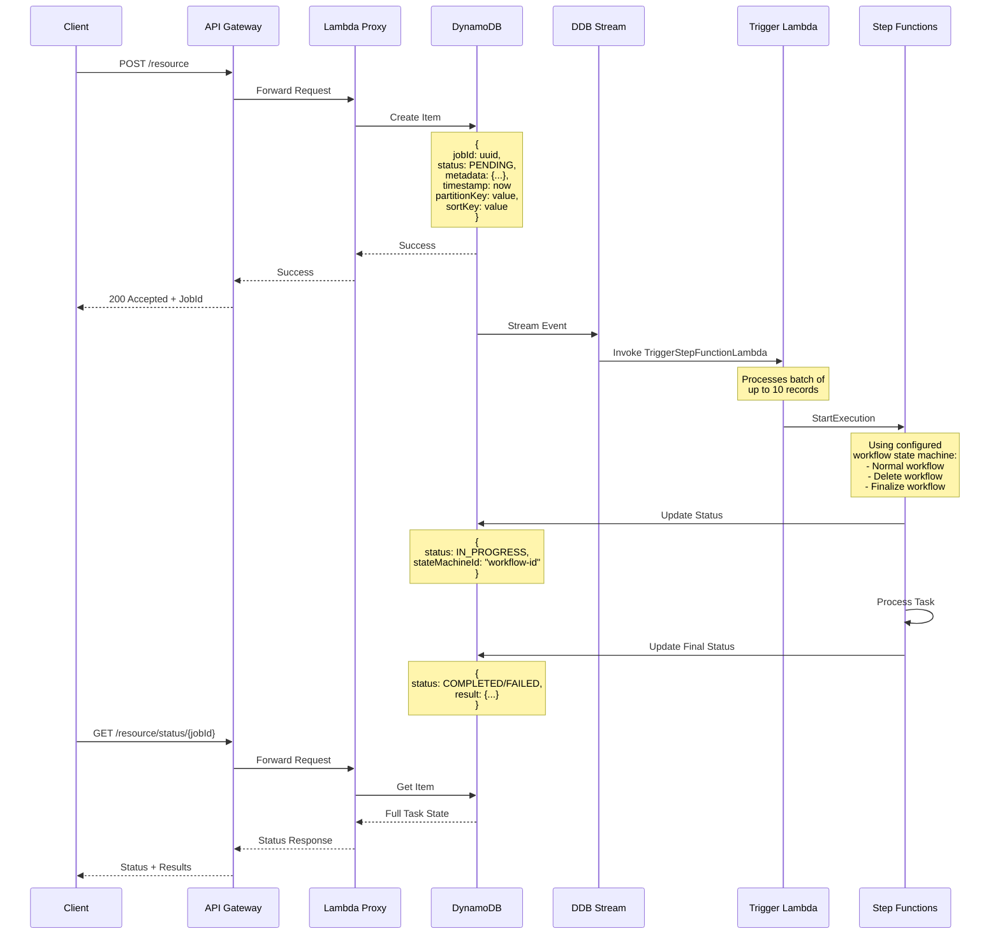

# Video Analytics Infrastructure Deployment

This directory contains the AWS CDK deployment code for both Device Management and Video Logistics components. The infrastructure is split into two main components to provide a clear separation of concerns and enable independent scaling and management for AWS managed Video Analytics services.

## Components Overview

### Common Constructs

The `VideoAnalyticsCommonConstruct` package provides shared infrastructure components used by both Device Management and Video Logistics. These constructs ensure consistency and reduce code duplication across the stacks.

#### Async Workflow Pattern

The core of our asynchronous operations is implemented in `video_analytics_async_workflow.ts`. This construct provides a templated asynchronous workflow pattern using DynamoDB Streams and Step Functions, which is used by the orchestration of both Device Management and Video Logistics for Video Analytics operations.

##### Workflow Architecture



#### Key Components

1. **API Gateway Integration**
   - Accepts client requests
   - Returns immediate response with task ID
   - Provides status check endpoint

2. **DynamoDB Table**
   - Stores task state and metadata
   - Enables stream processing
   - Maintains task history
   - References state machine ID
   - Tracks timestamps and results

3. **DynamoDB Streams**
   - Captures table changes
   - Triggers Lambda functions
   - Ensures reliable event processing

4. **Lambda Function**
   - Processes stream events
   - Initiates Step Functions execution using configured state machine
   - Handles error scenarios
   - Maps DDB events to workflow inputs

5. **Step Functions**
   - Manages workflow state
   - Executes business logic
   - Updates task status
   - Stores execution results

This pattern is used for operations such as:
- Device Management: Registration, Configuration Updates
- Video Logistics: Video Processing, Analytics Jobs

### Device Management
The Device Management component handles all aspects of IoT device registration, management, and lifecycle:
- Device registration and authentication
- Device health monitoring
- Configuration management
- Firmware updates
- Real-time device status tracking

### Video Logistics
The Video Logistics component manages video processing, streaming, and analytics:
- Video ingestion and storage
- Video processing pipelines
- Analytics and inference
- Timeline management
- Search capabilities via OpenSearch
- Bulk video processing

## CDK Stack Organization

### Device Management Stacks
- **Bootstrap Stack** (`DeviceManagementBootstrapStack`)
  - Initial setup and shared resources for Client side Account provisioning
  - IAM roles and policies
  - Base networking configuration

- **Workflow Stack** (`DeviceManagementWorkflowStack`)
  - Step Functions workflows for device management
  - Device registration flow
  - Configuration update processes

- **Service Stack** (`DeviceManagementServiceStack`)
  - Core API endpoints
  - Lambda functions for device operations
  - DynamoDB tables for device state

### Video Logistics Stacks
- **Bootstrap Stack** (`VideoLogisticsBootstrapStack`)
  - Initial setup and shared resources for Client side Account provisioning
  - IAM roles and policies
  - Base networking configuration

- **Timeline Stack** (`VideoLogisticsTimelineStack`)
  - Video timeline management
  - Metadata storage
  - Timeline indexing

- **OpenSearch Stack** (`VideoLogisticsOpensearchStack`)
  - Search infrastructure
  - Video metadata indexing
  - Analytics dashboards

- **Bulk Inference Stack** (`VideoLogisticsBulkInferenceStack`)
  - Batch processing infrastructure
  - ML model deployment
  - Processing queue management

- **Workflow Stack** (`VideoLogisticsWorkflowStack`)
  - Video processing workflows
  - State management
  - Error handling

- **Service Stack** (`VideoLogisticsServiceStack`)
  - Core API endpoints
  - Video processing Lambda functions
  - Storage management

## Build System

The deployment uses a TypeScript-based build system with the following key files:

- `package.json`: Root-level package configuration
  - Defines shared dependencies
  - Contains build scripts for the entire deployment
  - Manages TypeScript configuration
  - Key scripts:
    - `build`: Compiles all TypeScript code
    - `test`: Runs all CDK tests
    - `clean`: Cleans build artifacts

- `tsconfig.json`: TypeScript configuration
  - Shared compiler options
  - Module resolution settings
  - Build output configuration

## Project Deployment Structure Overview

The deployment infrastructure is organized into two main components and follows this structure:

```
deployment/
├── package.json
├── package-lock.json
├── tsconfig.json
├── node_modules/
│   ├── aws-cdk-lib/
│   ├── constructs/
│   └── ... (other shared dependencies)
├── common-constructs/
│   └── VideoAnalyticsCommonConstruct/
│       ├── package.json
│       ├── tsconfig.json
│       ├── lib/
│       │   └── ... (TypeScript Common constructs)
│       ├── node_modules/
│       │   └── ... (package-specific dependencies)
│       └── .gitignore
├── device-management-cdk/
│   └── VideoAnalyticsDeviceManagementCDK/
│       ├── package.json
│       ├── tsconfig.json
│       ├── lib/
│       │   └── ... (TypeScript Device Management CDK)
│       ├── node_modules/
│       │   └── ... (package-specific dependencies)
│       ├── cdk.json
│       └── .gitignore
└── video-logistics-cdk/
    └── VideoAnalyticsVideoLogisticsCDK/
        ├── package.json
        ├── tsconfig.json
        ├── lib/
        │   └── ... (TypeScript Video Logistics CDK)
        ├── node_modules/
        │   └── ... (package-specific dependencies)
        ├── cdk.json
        └── .gitignore
```

## Prerequisites

Before proceeding with the CDK deployment, ensure all required components are built in the correct order, in order to generate the necessary assets for Lambda Compute resources.

### 1. Build Source Packages and Assets

> For detailed instructions on necessary dependencies, see the [main README.md](../README.md#prerequisites-required).

#### Build Common Assets

1. **Build Common Smithy Models**
   ```bash
   # From repository root
   cd source/models/common
   smithy build
   ```

2. **Build Common Workflow Handler (For Common Async Workflow Assets)**
   ```bash
   # Build workflow handler assets
   cd ../../workflow-handler/VideoAnalyticsWorkflowHandler
   ./gradlew build
   ```
   This builds the common workflow application JAR and copies it to `assets/lambda-built/common-construct-assets/` for CDK deployment.

#### Build Device Management Assets

1. **Build Smithy Models**
   ```bash
   # From repository root
   cd source/models/device-management
   smithy build
   ```

2. **Generate OpenAPI Specifications**
   ```bash
   # Generate client SDK
   cd source/device-management/VideoAnalyticsDeviceManagementJavaClient
   ./gradlew openApiGenerate
   ```

3. **Build Control Plane Package**
   ```bash
   # Build JAR files
   cd ../VideoAnalyticsDeviceManagementControlPlane
   ./gradlew build
   ```
   This builds the main application JAR and copies it to `assets/lambda-built/device-management-assets/` for CDK deployment.

#### Build Video Logistics Assets

1. **Build Smithy Models**
   ```bash
   # From repository root
   cd source/models/video-logistics
   smithy build
   ```

2. **Generate OpenAPI Specifications**
   ```bash
   # Generate client SDK
   cd source/video-logistics/VideoAnalyticsVideoLogisticsJavaClient
   ./gradlew openApiGenerate
   ```

3. **Build Control Plane Package**
   ```bash
   # Build JAR files
   cd ../VideoAnalyticsVideoLogisticsControlPlane
   ./gradlew build
   ```
   This builds the Video Logistics control plane application JAR and copies it to `assets/lambda-built/video-logistics-assets/` for CDK deployment.

### 2. Build CDK Components

> For detailed development guidelines and testing practices, see [DEVELOPMENT.md](DEVELOPMENT.md).

1. **Install Global Dependencies**
   ```bash
   npm install -g aws-cdk typescript
   ```

2. **Install Root Project Dependencies**
   ```bash
   # From the deployment directory
   npm install
   ```

3. **Build Common Constructs**
   ```bash
   cd common-constructs/VideoAnalyticsCommonConstruct
   npm install
   npm run build
   cd ../..
   ```

## Building and Deploying CDK Infrastructure Components

### 1. Device Management

```bash
cd device-management-cdk/VideoAnalyticsDeviceManagementCDK
npm install

# Run tests and update snapshots if needed
npm run test -- -u

# To update specific test snapshots
npm run test -- -u -t "DeviceManagementBootstrapStack"
npm run test -- -u -t "DeviceManagementWorkflowStack"
npm run test -- -u -t "DeviceManagementServiceStack"

# Build and synthesize CloudFormation
npm run build
cdk synth

# Bootstrap CDK if needed (1st time only)
cdk bootstrap

# Deploy stacks in order
cdk deploy DeviceManagementBootstrapStack
cdk deploy DeviceManagementWorkflowStack
cdk deploy DeviceManagementServiceStack
```

### 2. Video Logistics

```bash
cd video-logistics-cdk/VideoAnalyticsVideoLogisticsCDK
npm install

# Run tests and update snapshots if needed
npm run test -- -u

# Build and synthesize CloudFormation
npm run build
cdk synth

# Bootstrap CDK if needed (1st time only)
cdk bootstrap

# Deploy stacks in order
cdk deploy VideoLogisticsBootstrapStack
cdk deploy VideoLogisticsTimelineStack
cdk deploy VideoLogisticsOpensearchStack
cdk deploy VideoLogisticsBulkInferenceStack
cdk deploy VideoLogisticsWorkflowStack
cdk deploy VideoLogisticsServiceStack
```

## Environment Variables

The deployment uses either explicitly set deployment variables OR falls back to default variables:

```bash
# Option 1: Set deployment-specific variables
export CDK_DEPLOY_ACCOUNT=your_aws_account_id
export CDK_DEPLOY_REGION=your_aws_region

# OR

# Option 2: Use default variables
export CDK_DEFAULT_ACCOUNT=your_aws_account_id
export CDK_DEFAULT_REGION=your_aws_region
```

The stack will use variables in this order:
1. `CDK_DEPLOY_ACCOUNT/REGION` if set
2. `CDK_DEFAULT_ACCOUNT/REGION` if set
3. Default values:
   - Region: "us-west-2"
   - Account: "YOUR_DEFAULT_ACCOUNT"

## Note

- CDK bootstrap is only required once per account/region combination
- Make sure to build the common constructs before deploying either component
- Follow the stack deployment order as specified above
- For detailed deployment validation steps, see [Deployment Validation](../README.md#deployment-validation-required) in the main README
- For development guidelines and testing practices, see [DEVELOPMENT.md](DEVELOPMENT.md)
