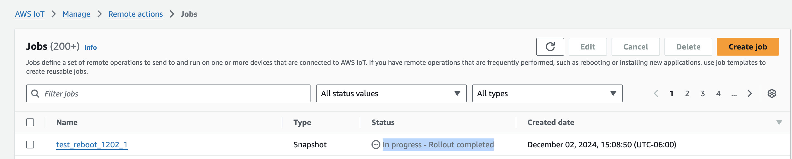

# Overview

This guidance recommends using an IoT Job to perform an update or action on a physical device remotely. These types of operation are called "commands". IoT jobs will provide the infrastructure (e.g existing MQTT topics and AWS managed job templates) to manage the remote operations and configurability for jobs. Remote reboot, factory reset, or firmware update of a device commands can all utilize this capability.

This capability requires edge and cloud components of the guidance to work together. The edge implementation provided in the guidance supports reboot of a device. For cloud, customers need to implement their own by following the provided Java reference sample code. 

Device reboot is used to demonstrate end-to-end how to remotely reboot a device. Customers can add more types of operation (e.g factory reset, control the pan/tilt/zoom of the camera) by mimicking the edge implementation for reboot and the cloud Java reference sample code provided in [Run](#run). See [Instructions to implement a new type of command](#instructions-to-implement-a-new-type-of-command) for instructions on adding new command types. 

## Assumptions: 

1. Device has been added to `SpecialGroup_EnabledState`. If the device was created using `StartCreateDevice`, by default the device should already be in `SpecialGroup_EnabledState`. If the device is not in `SpecialGroup_EnabledState`, see this [section] (<link state management section>) on how to move the device to `SpecialGroup_EnabledState`. 
2. The computer used for development is x86_64. 

## Pre-requisites:

1. Successfully deployed `deployment/device-management-cdk/VideoAnalyticsDeviceManagementCDK/lib/stacks/bootstrapStack/deviceManagementBootstrapStack.ts` to account.  
2. Successfully deployed `deployment/device-management-cdk/VideoAnalyticsDeviceManagementCDK/lib/stacks/optionalCapabilitiesStack/iotJobsDevicePermissionStack.ts`. Once deployed successfully, this stack will add necessary policies to Thing group `SpecialGroup_EnabledState` and will allow all devices in SpecialGroup_EnabledState to automatically inherit the policies. The policies will give device permission to IoT Job MQTT topics. Similarly, if customers wants any other thing groups to have access to iot Job MQTT topic, attach `IotJobPolicy_<region>` to the thing groups following the pattern in `iotJobsDevicePermissionStack.ts`

    [Tip] To simplify CDK deployment in production, customers can consider merging CDK code provided in `iotJobsDevicePermissionStack.ts` into `deviceManagementBootstrapStack.ts`. Note that merging the 2 CDK files is NOT required for the capability to work. 

3. Use a binary that is compiled with the remote operation capability. run CLI:

    a. for amrv7
    ```
    cross build --target armv7-unknown-linux-gnueabihf --release
    ```
    If successfully compiled, the binary can be found at `guidance-for-video-analytics-infrastructure-on-aws/source/edge/target/armv7-unknown-linux-gnueabihf/release/edge-process`
    
    b. for x86_64
    ```    
    cargo build
    ```
    If successfully compiled, the binary can be found at `guidance-for-video-analytics-infrastructure-on-aws/source/edge/target/debug/edge-process`

## Instructions to run and verify the capability
### Run:

1. Run the binary on device
```
./edge-process -c <path to config yaml file>
```

2. Execute the Java code below

  [Tip] Customers can choose to 1/embed the Java code provided here to an existing application or 2/implement the Java code  following this guidance's server-less pattern of `APIGW → Lambda` for synchronous operation or `APIGW -> Lambda -> DDB -> StepFunction` for asynchronous operations. 

    ```
    import software.amazon.awssdk.services.iot.IotClient;
    import software.amazon.awssdk.services.iot.model.*;
    import java.util.Collections;
    import java.util.UUID;

    public void createIoTJobForCommand(
        final String thingName,
        final String region,
        final String accountId
    ) {
        // Validate if device exists
        System.out.println("Checking if device exist.");
        try {
            iotClient.describeThing(DescribeThingRequest.builder().thingName(thingName).build());
        } catch (ResourceNotFoundException e){
            System.out.printf("Thing %s doesn't exist.%n", thingName);
            return;
        }
        
        final String IOT_FLEET_INDEXING_CONNECTIVITY = "connectivity.connected:";
        final String IOT_FLEET_INDEXING_THING_NAME = "thingName:"; 
        final String IOT_FLEET_INDEXING_INDEX_NAME = "AWS_Things";
        System.out.println("Checking if device is connected.");
        System.out.printf("Searching within index: %s.", IOT_FLEET_INDEXING_INDEX_NAME);

        // generate the query "connectivity.connected:true AND thingName:exampleThing"
        String deviceConnectedQuery = IOT_FLEET_INDEXING_CONNECTIVITY + "true" + " AND " + IOT_FLEET_INDEXING_THING_NAME + thingName;
        SearchIndexRequest searchIndexRequest = SearchIndexRequest
                .builder()
                .indexName(IOT_FLEET_INDEXING_INDEX_NAME)
                .queryString(deviceConnectedQuery)
                .build();

        SearchIndexResponse searchIndexResponse = iotClient.searchIndex(searchIndexRequest);
        // Do nothing if device is not connected. Only proceed to perform remote operations on a device that's connected
        if (searchIndexResponse.things().size() != 1) {
            System.out.println("Device is not connected. No-op for remote operation!");
            return;
        };
        System.out.println("Device is connected.");

        System.out.println("Creating IoT Job for AWS-Run-Command Template");

        String target = String.format("arn:aws:iot:%s:%s:thing/%s",
            region,
            accountId,
            thingName);

        String jobId = UUID.randomUUID().toString()
        CreateJobRequest jobRequest = CreateJobRequest
        .builder()
        // Required field for IoT API CreaetJob
        .jobId(jobId)
        // Required field for IoT API CreaetJob
        .targets(Collections.singletonList(target))
        // Optional field for IoT API CreaetJob
        .targetSelection(TargetSelection.SNAPSHOT)
        // Optional field for IoT API CreaetJob 
        .description("This is a job for remotely reboot a device")
        // Optional field for IoT API CreaetJob 
        // documentParameters payload for reboot device: 
        // "command" is the default key for the key value pair in this guidance. 
        // If "command" is replaced with another keyword, make sure edge-process is also updated accordingly <link code>
        .documentParameters(Collections.singletonMap("command", "REBOOT"))
        // Optional field for IoT API CreateJob. Set timeout to 10 minutes in this example
        .timeoutConfig(t -> t.inProgressTimeoutInMinutes(10L))
        // Optional field for IoT API CreateJob 
        .jobExecutionsRetryConfig(j -> {
                    j.criteriaList(Collections.singleton(
                                    RetryCriteria.builder()
                                            .failureType(RetryableFailureType.ALL)
                                            // Set retries to 10 in this example
                                            .numberOfRetries(10)
                                            .build()
                            )
                    );
                })
        .jobTemplateArn(String.format("arn:aws:iot:%s::jobtemplate/AWS-Run-Command:1.0", region))
        .build();

        try {
            iotClient.createJob(jobRequest);
        } catch (IotException e) {
            System.out.println(e);
        }

        System.out.printf("Created a new job %s.", jobId);

        return;
    }    
    ```

3. As part of the reboot, the binary would stop running when the device is turned off.  After device is back on after the reboot, run the binary on device 

```
./edge-process  -c <path to config yaml file>
```

### Verify:

1. After Java code is executed, if LOG_LEVEL on device is set to INFO, DEBUG, or TRACE, customers should see below logs printed on the device terminal
    ```
     INFO  System reboot ONVIF request was sent to process 1 successfully. Response from process 1: "System is now rebooting. rebooting may take about one minute."
     INFO  Initiated reboot
    ```
    printed in the terminal on device. Alternatively, customers can also check the logs in cloud trail. 
    // TODO: <link to the section with instructions on how to look for logs in cloud trail>
2. Go to AWS IoT console. In the menu bar on the left under “Manage”, find Remote actions > Jobs. Search the job using JobId (the UUID randomly generated in the Java code above). Job status should be "In progress" after the device is turned off temporarily as part of the reboot. 
    |  |
    | :---------------------------------------------------------------------------: |
    |               *Screenshot: IoT Job in progress*                |

3. Device that's running the binary should experience temporary shut down as part of the reboot process. The binary running on device should stop. Device should also stop streaming to KVS. 
4. After edge-process binary is up and running after step 3 in the previous section [Run:](#run), Job status should be "Completed". And customers should see below logs printed on the device terminal
    ```
    INFO  Successfully got next pending job execution.
    INFO  Checking if an existing reboot command is in progress.
    INFO  Confirmed a reboot command is in progress. 
    INFO  Message published to IoT with topic : $aws/things/<thing-name>/jobs/<job-id>/update
    INFO  Successfully updated command status.
    ```
5. Once the IoT job status is “Completed” and edge-process is up and running, the device should be connected to IoT and be running again. 
    |  |
    | :---------------------------------------------------------------------------: |
    |               *Screenshot: IoT Job completed*                |

    a. There are multiple ways to check if a device is connected. One way is using AWS IoT console. In the menu bar on the left under “Manage”, find All devices > Things > Advanced Search button. Use the query `"connectivity.connected:true AND thingName:<device thing name>”` to search. 

    |  |
    | :---------------------------------------------------------------------------: |
    |               *Screenshot: IoT search connected thing*                |

## Instructions to implement a new type of command
Using soft factory reset (supported by ONVIF compliant devices) as an example

### Edge Rust code
1. Add the ONVIF API request and response Rust struct to `source/edge/crates/onvif-client/src/wsdl_rs/devicemgmt.rs`. See https://github.com/lumeohq/onvif-rs/tree/main on how to create Rust structs for ONVIF APIs. 

2. Add a new function to [OnvifClient](https://github.com/aws-solutions-library-samples/guidance-for-video-analytics-infrastructure-on-aws/blob/develop/source/edge/crates/onvif-client/src/client/onvif_client.rs#L52) as an interface for the ONVIF API that supports this new command.

3. Add a function to [DeviceStateModel](https://github.com/aws-solutions-library-samples/guidance-for-video-analytics-infrastructure-on-aws/blob/develop/source/edge/crates/device-traits/src/lib.rs#L22). 

4. Add the new command to `Command` enum in `source/edge/crates/device-traits/src/command.rs` and other struct that depends on `Command`, like `as_str` and `from_str`. For soft factory reset: 
    ```
    pub enum Command {
        /// Reboot
        Reboot,
        /// Unknown command type
        Unknown,
        /// Soft factory reset <----new command type SoftFactoryReset
        SoftFactoryReset
    }

    impl Command {
        /// converting enum to str
        pub fn as_str(&self) -> &'static str {
            match self {
                Command::Reboot => "REBOOT",
                Command::Unknown => "UNKNOWN",
                Command::SoftFactoryReset => "SOFT_FACTORY_RESET",  <----new command type SoftFactoryReset
            }
        }
    }
    impl FromStr for Command {
        type Err = ();
        fn from_str(input: &str) -> Result<Command, Self::Err> {
            match input {
                "REBOOT" => Ok(Command::Reboot),
                "SOFT_FACTORY_RESET" => Ok(Command::SoftFactoryReset), <----new command type SoftFactoryReset
                _ => Err(()),
            }
        }
    }
    ```

3. Add logic in `source/edge/crates/edge-process/src/bin/main.rs` to handle the new command type. Example for soft factory reset
    ```
    ...
    match command_type {
        ...

        Command::SoftFactoryReset => {
            info!("Trying to soft factory reset device");
            let res = onvif_client.soft_factory_reset().await;
            if res.is_err() {
                error!("Error soft factory reset device: {:?}", res);
                update_command_status(CommandStatus::Failed, job_id_str.to_string());
            } else {
                info!("Initiated soft factory reset");
            }
        },

        ...
    }
    ...
    ```

3. Compile the binary and test it on device. 

### Cloud java code 
1. Create a name for the new command. In this case, `SOFT_FACTORY_RESET`. 
2. For CreateJobRequest’s documentParameters field, use the operation name as the key value pair. For example:

```
.documentParameters(Collections.singletonMap("command", "SOFT_FACTORY_RESET"))
```


